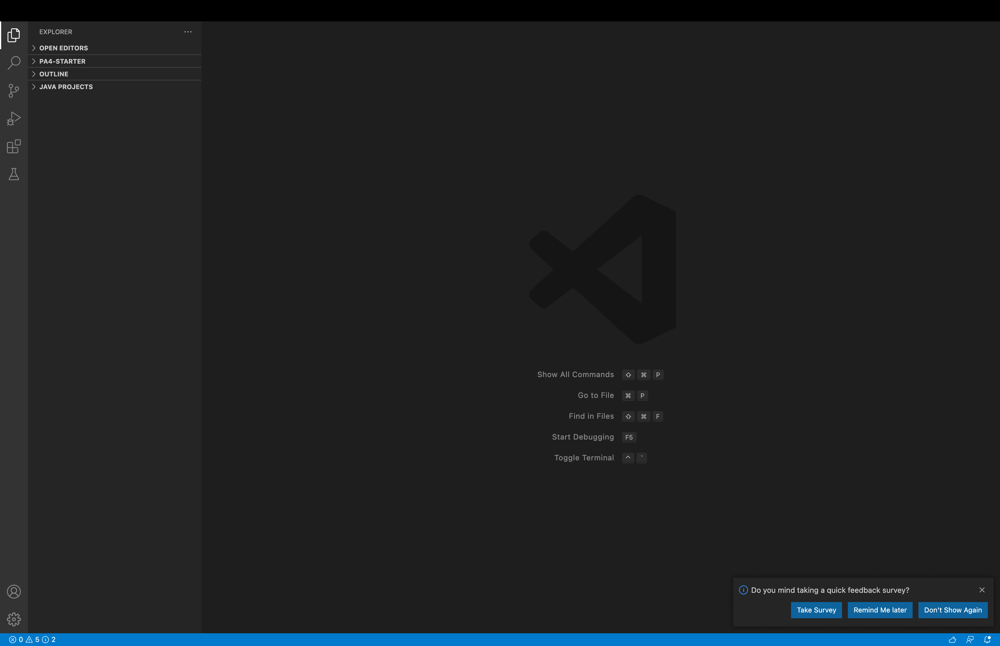
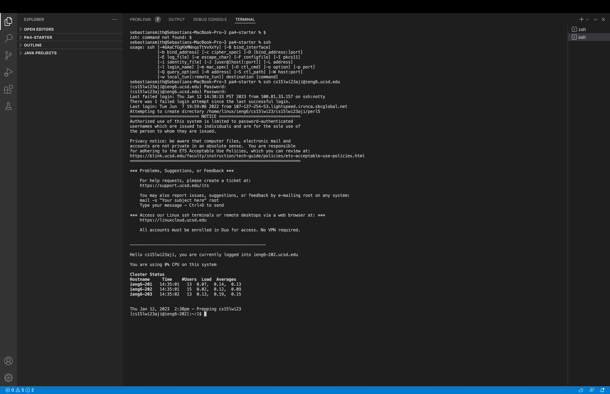
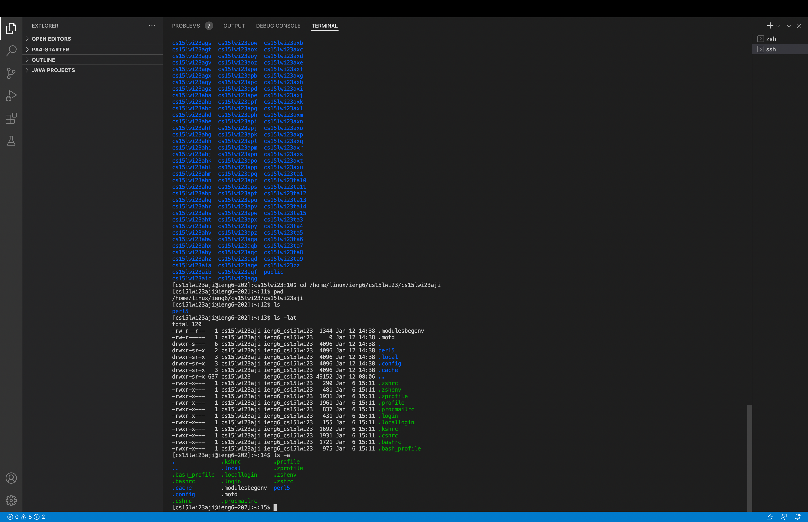

# CSE 15L Lab 1
For this lab you first need to look up your couse specific CSE15L acount and reset your password on the website: 
https://sdacs.ucsd.edu/~icc/index.php
You will first need to log in using your UCSD username and PID.
Once you log in, click on your cse15L acount name (it will be highlighted in blue). Your account name will we something like cs15lfa22zz.
Then it will navigare you to a page to reset your password. Click on the blue link that asks you to change your password.
Now you are going to enter your curent password for you triton link acount then you can enter that same password for your new password or a different password for your new password.
This is important make sure you put no on the box that says to change your tritonLink password. Now you can click change password.
Now you have to download visual studio code for this lab. Go to this link to download:
https://code.visualstudio.com/
If you have mac download the mac version, if you have windows64 or 32 download the corect version. 
Once you have visual studio code downloaded and opened, it should look something like this:

I already had visual studio code downloaded so all I had to do was open visual studio code up.
Now you are going to open the terminal in visual studio code. You can do this by selecting terminal at the top and selecting new terminal.
Next you are going to log in to the UCSD remote server using visual studio code.
To enter the remote server enter this: **ssh cs15lwi23zz@ieng6.ucsd.edu**
But instead of the zz enter your letters in your acount you found earlier in the lab.
If it asks you if you want to continue connecting, type yes.
Next you are going to type in your password you just reset. (Notice: If it's been less than 15 min after you reset your password it might not work)
After you type in your password your terminal should look something like this:

In this image I misread the directions and typed in $ eventhough I should not have and then I didn't know it did not show you the character when typing the password so I messed up the first password. I also did not get a message asking if you would like to continue like my lab partners did for some reason.
If you mess up the password once you will get a notice like my picture where it tells you there was 1 failed attempt on your acount.
Once you enter the remote server, run some commands such as cd, ls, pwd, mkdir, cp, cd ~, ls -lat, ls -a and ls <directory> where directory is the directory is someone in your group
If you run some of those commands it should look like this:

In this image I ran the command pwd which printed the working directory then I ran the command ls which means list and it printed out perl15, I do not know what perl15 means. Then I tried some of the commands such as ls -lat and ls -a. I also did not know what the output of those commands meant. I also tried the cd command and accidentaly exited my diretory, I went back to my directory by using the command cd /home/linux/ieng6/cs15lwi23/cs15lwi23aji.
Finally you can exit the remote server by typing exit.

