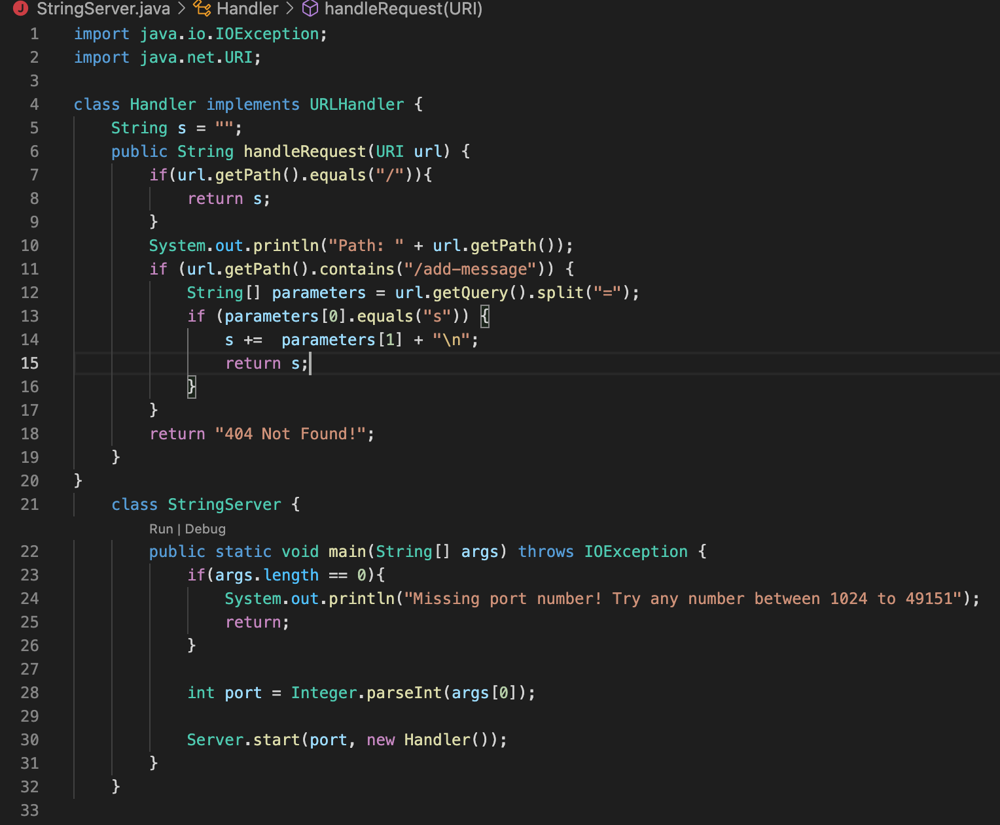
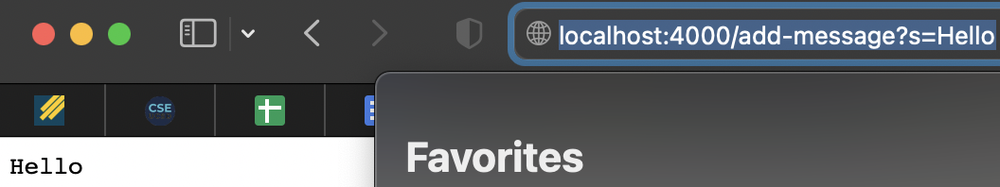
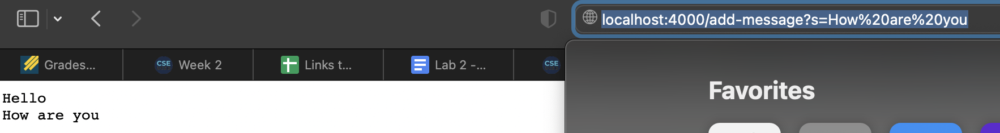

# CSE 15L Lab Report 2
 
1. The methods that are called on this screenshot are the main method in the StringServer class, the start method in the server class, and the handle method in the serverHttpHandler class 
2. The argument for the main method in the Stringserver class is String[] args and a field is int port. The argument for the handleRequest is the url and the field is string s. The argument for the start method is the port and the handler and the field is the HttpServer server. The argument for the handle method is httpExchange exchange and the field is string ret
3. The value for the main method is 4000. The value for the handleRequest method is "Hello". The value for the start method is httpServer.create(new InetSocketAddress(4000), 0);. The value for the handle method is handler.handleRequest(exhange.getRequestURI());

1. The methods that are called on this screenshot are the main method in the StringServer class, the start method in the server class, and the handle method in the serverHttpHandler class 
2. The argument for the main method in the Stringserver class is String[] args and a field is int port. The argument for the handleRequest is the url and the field is string s. The argument for the start method is the port and the handler and the field is the HttpServer server. The argument for the handle method is httpExchange exchange and the field is string ret
3. The value for the main method is 4000. The value for the handleRequest method is "Hello" + "\n" + "How are you". The value for the start method is httpServer.create(new InetSocketAddress(4000), 0);. The value for the handle method is handler.handleRequest(exhange.getRequestURI());

