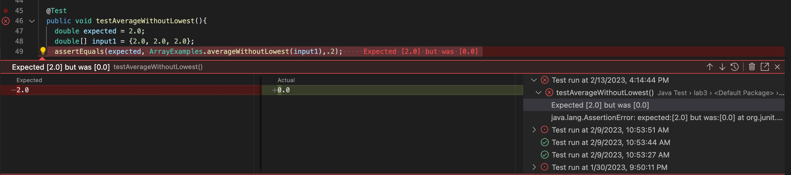
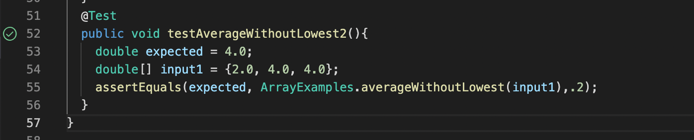
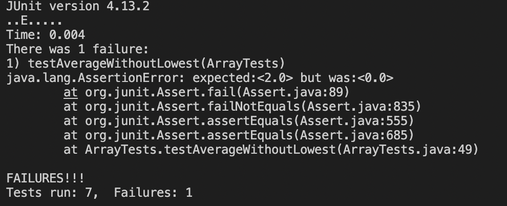

# CSE 15L Lab Report 2
# Part 1
 
```
 class StringServer {
        public static void main(String[] args) throws IOException {
            if(args.length == 0){
                System.out.println("Missing port number! Try any number between 1024 to 49151");
                return;
            }
    
            int port = Integer.parseInt(args[0]);
    
            Server.start(port, new Handler());
        }
    }
 ```
 ```
 public class Server {
    public static void start(int port, URLHandler handler) throws IOException {
        HttpServer server = HttpServer.create(new InetSocketAddress(port), 0);

        //create request entrypoint
        server.createContext("/", new ServerHttpHandler(handler));

        //start the server
        server.start();
        System.out.println("Server Started! Visit http://localhost:" + port + " to visit.");
    }
}
```
```
class ServerHttpHandler implements HttpHandler {
    URLHandler handler;
    ServerHttpHandler(URLHandler handler) {
      this.handler = handler;
    }
    public void handle(final HttpExchange exchange) throws IOException {
        // form return body after being handled by program
        try {
            String ret = handler.handleRequest(exchange.getRequestURI());
            // form the return string and write it on the browser
            exchange.sendResponseHeaders(200, ret.getBytes().length);
            OutputStream os = exchange.getResponseBody();
            os.write(ret.getBytes());
            os.close();
        } catch(Exception e) {
            String response = e.toString();
            exchange.sendResponseHeaders(500, response.getBytes().length);
            OutputStream os = exchange.getResponseBody();
            os.write(response.getBytes());
            os.close();
        }
    }
}
```
1. The methods that are called on this screenshot are the main method in the StringServer class, the start method in the server class, and the handle method in the serverHttpHandler class 
2. The argument for the main method in the Stringserver class is String[] args and a field is int port. The argument for the handleRequest is the url and the field is string s. The argument for the start method is the port and the handler and the field is the HttpServer server. The argument for the handle method is httpExchange exchange and the field is string ret
3. The value for the main method is 4000. The value for the handleRequest method is "Hello". The value for the start method is httpServer.create(new InetSocketAddress(4000), 0);. The value for the handle method is handler.handleRequest(exhange.getRequestURI());

1. The methods that are called on this screenshot are the main method in the StringServer class, the start method in the server class, and the handle method in the serverHttpHandler class 
2. The argument for the main method in the Stringserver class is String[] args and a field is int port. The argument for the handleRequest is the url and the field is string s. The argument for the start method is the port and the handler and the field is the HttpServer server. The argument for the handle method is httpExchange exchange and the field is string ret
3. The value for the main method is 4000. The value for the handleRequest method is "Hello" + "\n" + "How are you". The value for the start method is httpServer.create(new InetSocketAddress(4000), 0);. The value for the handle method is handler.handleRequest(exhange.getRequestURI());
# Part 2
``` 
@Test
  public void testAverageWithoutLowest(){
    double expected = 2.0;
    double[] input1 = {2.0, 2.0, 2.0};
    assertEquals(expected, ArrayExamples.averageWithoutLowest(input1),.2);
    }
 ```
 
 ``` 
  @Test
  public void testAverageWithoutLowest2(){
    double expected = 4.0;
    double[] input1 = {2.0, 4.0, 4.0};
    assertEquals(expected, ArrayExamples.averageWithoutLowest(input1),.2); 
  }
   ``` 
 
The symptom is that the method averageWithoutLowest produces the wrong output when all the elements in the array are the same. The bug is that when the array has all the same elements, the method does not add anything to the varaiable sum which is originally equal to 0. So when the method returns sum / (arr.length -1), it will always return 0 instead of the correct value.
# Part 3
What I learned in week 2 and week 3 that I did not know before is I did not know what a webserver was, now I know that a wbserver takes requests from people through a web browser and responds with a text of a web page. I also learned how to read a url (I know what the domain, path and query are). And finally I know how to spot symptoms and bugs in methods.

    


